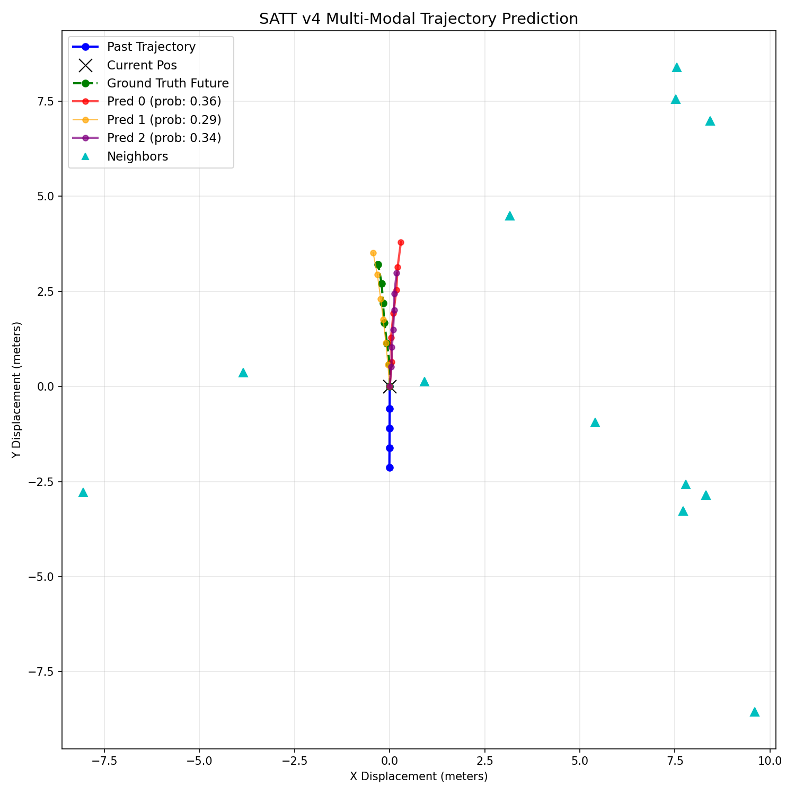
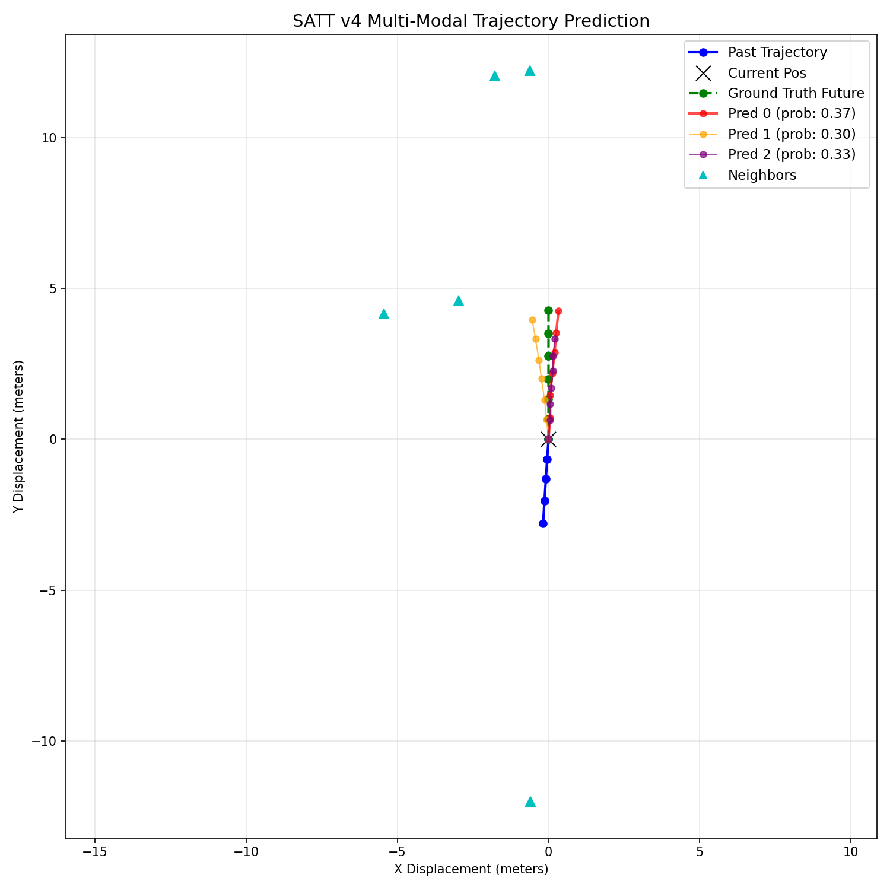
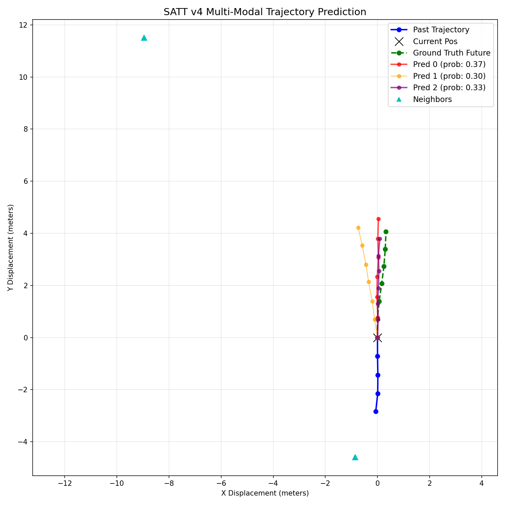
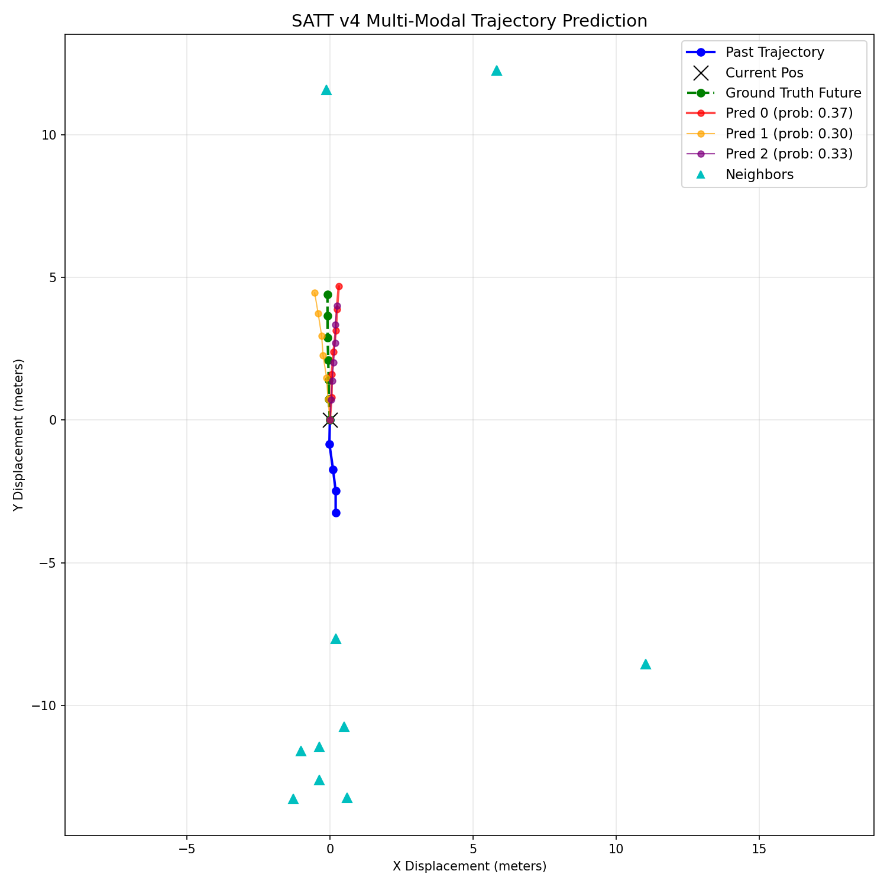

# 🚗 SATT — Social-Attention Trajectory Transformer

**PathForge — Intent & Trajectory Prediction for L4 Urban Autonomous Driving**

---

## 📋 Project Overview

This project addresses the problem of **predicting the future trajectories of pedestrians and cyclists** in urban driving environments — a critical capability for Level-4 autonomous vehicles.

Given **2 seconds of observed past motion** (5 timesteps at 2 Hz) and social context from surrounding agents, the model forecasts the **3 most likely future paths** over the next **3 seconds** (6 timesteps) with associated confidence scores.

**Key highlights:**
- Pure PyTorch implementation (no external perception frameworks)
- Trained and runs on **CPU only** (Apple M4 Mac, ~3 min training)
- **0.35 ms** inference per agent — real-time capable
- Uses the **nuScenes** public dataset (real-world urban driving from Boston & Singapore)

---

## 🏗️ Model Architecture

The **Social-Attention Trajectory Transformer (SATT)** consists of four main components:

```
Input (x, y, dx, dy, heading, class, moving)
        │
        ▼
┌─────────────────────┐
│  Temporal Encoder    │  ← 2-layer Transformer + Positional Encoding
│  (5 history steps)   │
└────────┬────────────┘
         │
         ▼
┌─────────────────────┐     ┌──────────────────┐
│  Social Attention    │◄────│ Neighbor Encoder  │ ← Dedicated 2-layer MLP
│  (Multi-Head + Skip) │     │ (20 closest agents)│
└────────┬────────────┘     └──────────────────┘
         │
         ▼
┌─────────────────────┐
│  Multi-Modal Decoder │  ← K=3 modes, 3-layer MLP + Residual
│  + Confidence Head   │    LayerNorm-stabilized logits
└────────┬────────────┘
         │
         ▼
   K=3 predicted trajectories + confidence scores
```

| Component | Details |
|---|---|
| **Temporal Encoder** | 2-layer Transformer (4 heads, FFN=512, dropout=0.2) with sinusoidal positional encoding |
| **Social Encoder** | 2-layer MLP encoding up to 20 nearest neighbors within 15m |
| **Social Attention** | Multi-head attention (target as Q, neighbors as K/V) + residual skip connection |
| **Multi-Modal Decoder** | 3-layer MLP with residual → K=3 trajectory modes + LayerNorm confidence head |

**Model stats:** 593K parameters | 2.3 MB checkpoint | 0.35 ms/inference on CPU

---

## 📊 Dataset Used

**nuScenes Mini Split** — a public autonomous driving benchmark by Motional.

| Property | Detail |
|---|---|
| **Source** | [nuScenes](https://www.nuscenes.org/nuscenes#download) (mini split) |
| **Locations** | Boston & Singapore urban streets |
| **Target agents** | Pedestrians & cyclists (vulnerable road users) |
| **Input modality** | Tracklet annotations (position, rotation, attributes) — no images |
| **Train / Val split** | 8 scenes (~2,400 sequences) / 2 scenes (~870 sequences) |
| **Sampling rate** | 2 Hz (0.5s between timesteps) |
| **Observation window** | 5 steps (2 seconds history) → 6 steps (3 seconds future) |

**Feature vector (7-dim per timestep):** `[x, y, dx, dy, heading, is_cyclist, is_moving]`

**Preprocessing:**
- Origin-shift to current agent position
- Heading alignment to agent-local +Y frame (rotation invariance)
- Euclidean neighbor sorting (nearest 20 within 15m)

**Augmentation (train only):**
- Random rotation jitter (±15°)
- Horizontal flip (50%)
- Gaussian noise (σ=0.05) on history only

---

## ⚙️ Setup & Installation

### Prerequisites
- Python 3.10+
- pip

### Installation

```bash
# 1. Clone the repository
git clone https://github.com/kushals256/PathForge-intent-trajectory-prediction-model.git
cd PathForge-intent-trajectory-prediction-model

# 2. Create and activate virtual environment
python -m venv venv
source venv/bin/activate        # macOS / Linux
# venv\Scripts\activate          # Windows

# 3. Install dependencies
pip install -r requirements.txt
```

### Download the Dataset

1. Download the **nuScenes mini split** from [nuscenes.org](https://www.nuscenes.org/nuscenes#download)
2. Extract it so the directory structure looks like:

```
project-root/
├── v1.0-mini/
│   └── v1.0-mini/
│       ├── sample_annotation.json
│       ├── instance.json
│       ├── category.json
│       ├── sample.json
│       ├── attribute.json
│       └── scene.json
```

### Dependencies

```
torch
numpy
matplotlib
tqdm
```

---

## 🚀 How to Run the Code

### Train the Model

```bash
python train.py
```

- Trains for up to 200 epochs with early stopping (patience=30)
- Saves best model to `best_model.pth`
- **Training time: ~3 minutes** on Apple M4 Mac (CPU)

### Evaluate the Model

```bash
python evaluate.py
```

This will:
1. Run **standard evaluation** (minADE₃ / minFDE₃ by class)
2. Run **Test-Time Augmentation (TTA)** evaluation
3. Generate **bird's-eye-view visualization** plots (`vis_*.png`)

### Quick Inference Demo

```bash
python predict.py
```

Runs a single-sample prediction and prints the 3 predicted trajectories with confidence scores.

---

## 📈 Example Outputs / Results

### Quantitative Results

| Metric | Score |
|---|---|
| **Total minADE₃** | **0.213 m** |
| **Total minFDE₃** | **0.389 m** |
| Pedestrian minADE₃ | 0.215 m (n=837) |
| Bicycle minADE₃ | 0.172 m (n=35) |

### Training Progression

| Version | minADE₃ | Key Change |
|---|---|---|
| v1 | 0.293 m | Base SATT architecture |
| v2 | 0.284 m | + Diversity loss + gradient clipping |
| v3 | 0.267 m | + Heading invariance + neighbor sorting |
| **v4** | **0.213 m** | + 10-fix audit (noise fix, deep decoder, residuals) |

> **27% improvement** from v1 → v4 through iterative refinements.

### Visualization Samples

The evaluation script generates bird's-eye-view plots showing:
- 🔵 **Blue** — Past trajectory (2s history)
- 🟢 **Green** — Ground truth future
- 🔴🟠🟣 **Red/Orange/Purple** — 3 predicted modes (line width ∝ confidence)
- 🔷 **Cyan triangles** — Nearby agents

| | |
|---|---|
|  |  |
|  |  |

---

## 📁 Project Structure

```
├── data/
│   └── dataset.py              # Zero-dependency nuScenes JSON parser
├── model/
│   ├── encoder.py              # Transformer temporal encoder
│   ├── social_attention.py     # Multi-head attention + residual skip
│   ├── decoder.py              # K=3 multi-modal decoder + LayerNorm
│   └── trajectory_predictor.py # Full SATT assembly
├── utils/
│   └── metrics.py              # minADE / minFDE computation
├── train.py                    # Training loop (WTA + diversity + warmup)
├── evaluate.py                 # Dual-class eval + TTA + BEV plots
├── predict.py                  # CLI inference demo
├── best_model.pth              # Pre-trained model checkpoint
└── requirements.txt            # Dependencies
```

---

## 🔧 Key Technical Features

- **Coordinate Heading Invariance**: All trajectories rotated to agent-local +Y frame
- **Winner-Takes-All Loss**: Only backpropagates through the closest mode
- **Hinge Diversity Loss**: Prevents mode collapse by penalizing modes < 0.5m apart
- **Euclidean Social Sorting**: Nearest 20 neighbors selected by distance
- **Gaussian Noise Augmentation**: Applied to history only (not ground truth)
- **Early Stopping**: Patience-based (stops when validation plateaus)
- **LR Warmup + Cosine Decay**: Stabilized Transformer training
- **Test-Time Augmentation**: 8-rotation ensemble for robust inference

---

## 📜 License

This project was developed for the AI in Mobility Challenge.

---

## Acknowledgment

Developed by Team Hephaesteans as part of the MAHE Mobility Challenge 2026.
